# [Car rental landing page](https://denyschr.github.io/dizrental/)

## What I used:
- HTML
- CSS
- Javascript
- SCSS
- GULP
- Webpack
## Features:
- Adaptive to 320px
- Use of BEM methodology
- Use of relative units (em & rem)
- Observing basic semantic rules
- Burger menu
- Modal window
- Slider
- Filter
- Spoilers
- Scroll to the top of the page

### Header

### Section 'hero'
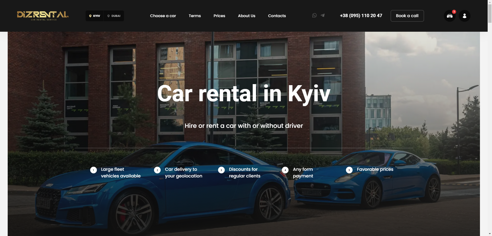

### Section 'order'
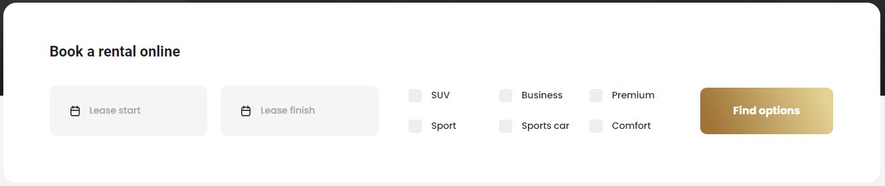

### Section 'car fleet'
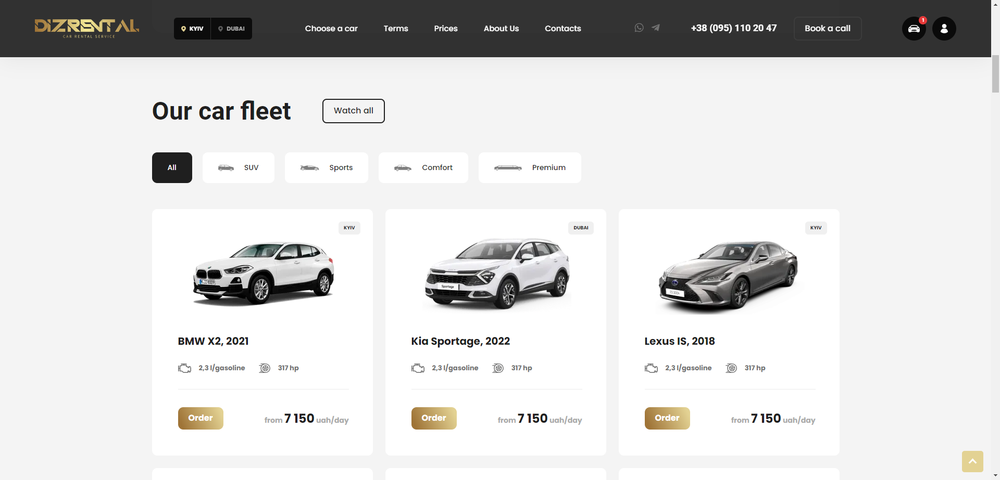

### Section 'car fleet'
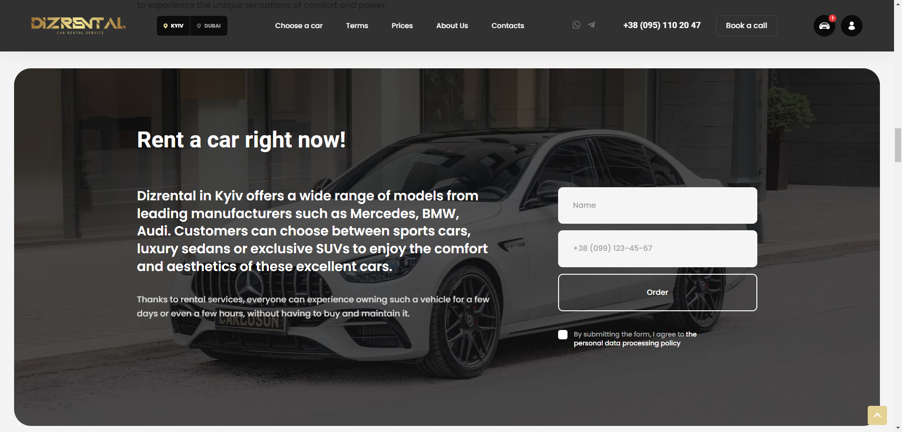

### Section 'event'
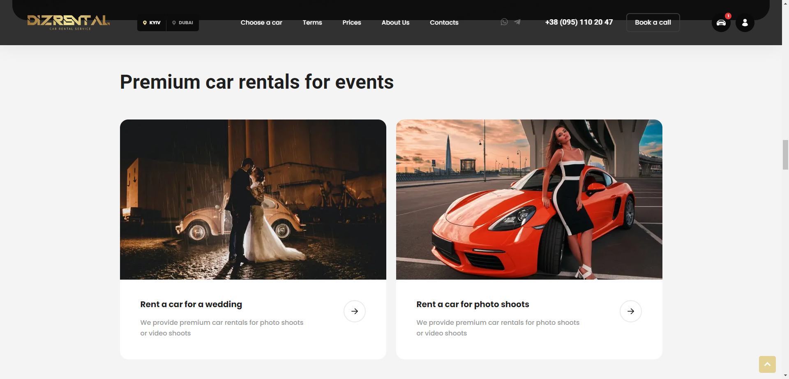

### Section 'step'
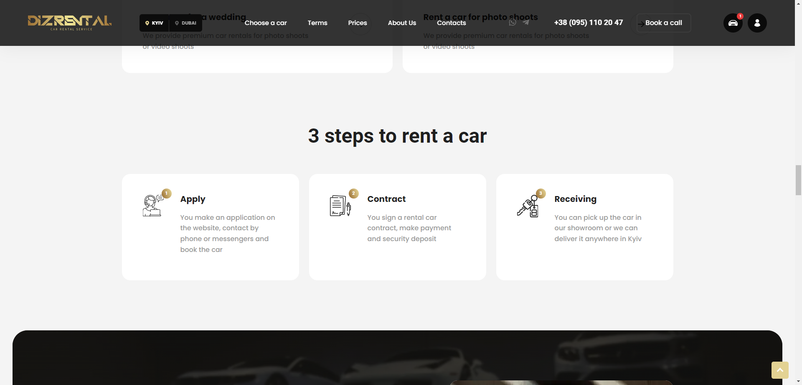

### Section 'bonus'
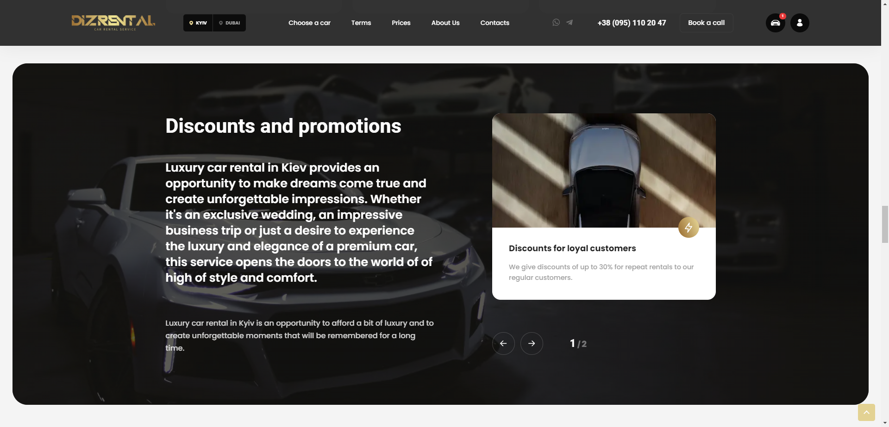

### Section 'reason'

### Section 'car-hire'
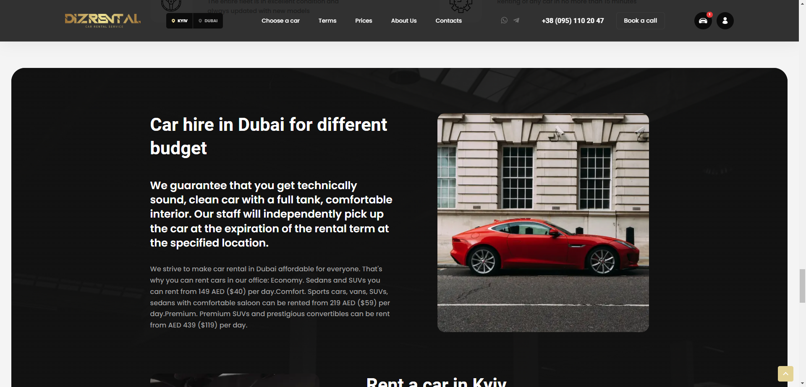

### Section 'car-hire'
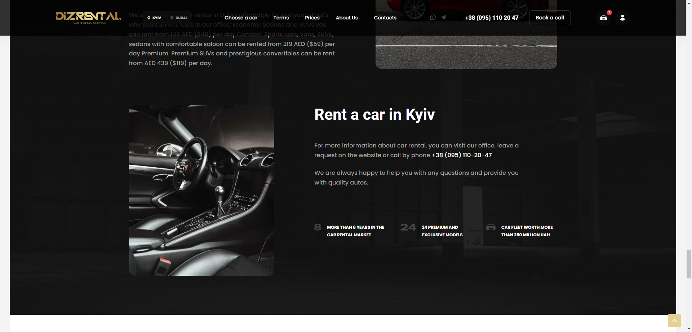

### Section 'brand' (infinite carousel)

### Section 'contacts'
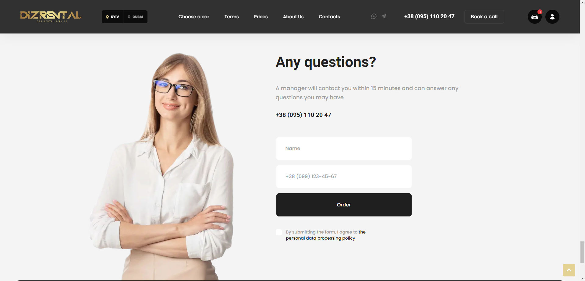

### Footer
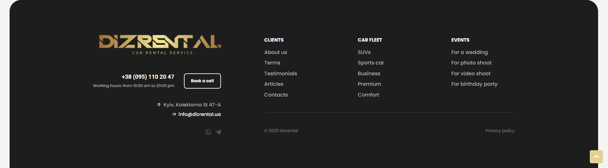

### Modal
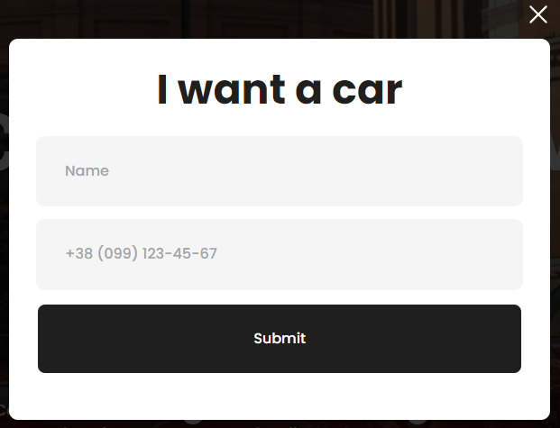

### Burger menu
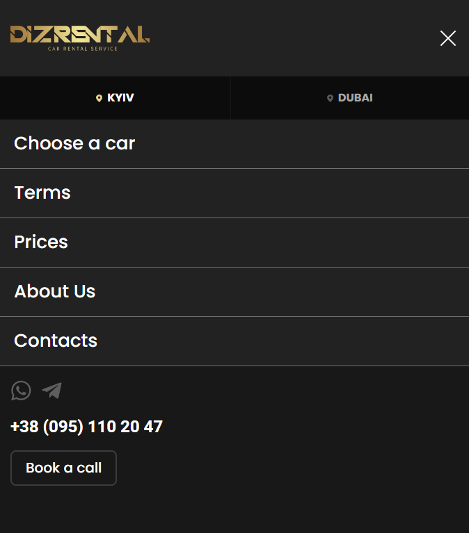

### Spoilers
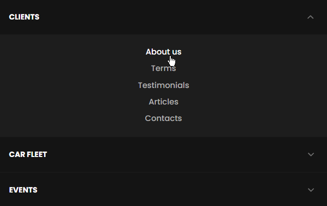